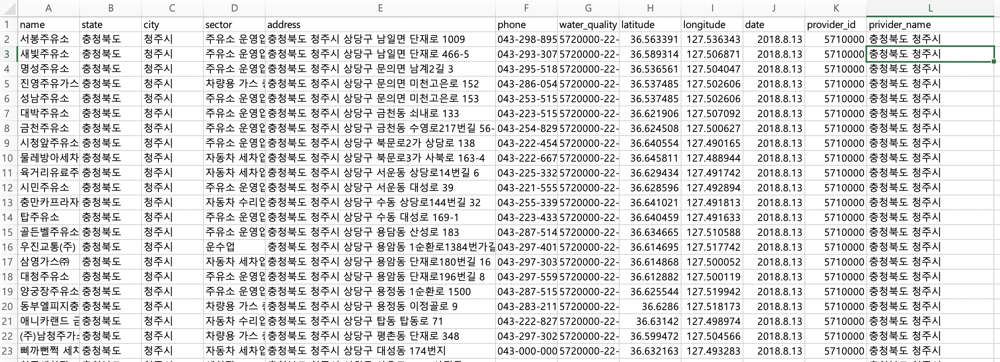
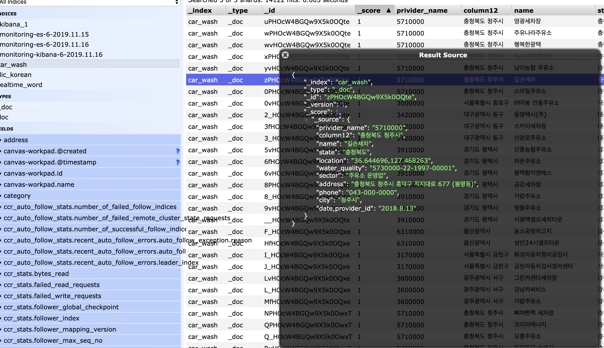
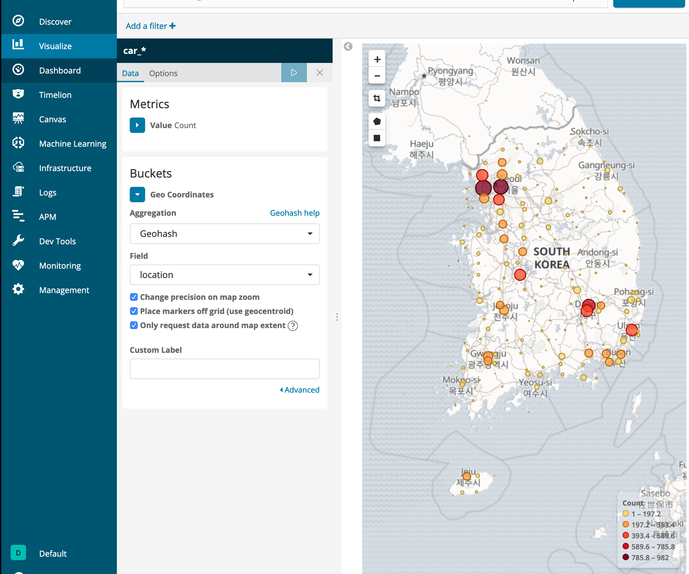

# 전국 세차장 정보 검색 

자신의 위치에서 가까운 전국의 세차장 을 검색하기 위해서 새로운 주제를 시작했다.

실제로는 geo_point를 써보고싶어서 맞춰서 작업!! 

https://www.data.go.kr/dataset/15013193/standard.do

수정을 한 세차장 정보는 다음과 같다 .




이제 데이터를 넣어보자.


잠깐 데이터를 넣기 전에 geopoint 형식으로 데이터를 삽입할것이기때문에 location의 데이터 타입을 `geo-point` 로 변경하자 .

`injest pipeline` 을 사용해보는것도 추천한다.

```shell
PUT car_wash
{
  "mappings": {
    "_doc": {
      "properties": {
        "location": {
          "type": "geo_point"
        }
      }
    }
  }
}
```


다양한 방법이 있지만 logstash를 통해서 쉽게 데이터를 넣어보자 ! 

`logstash 를 사용해서 편리하게 넣을수 있지만, 다음에는 java를 REST API를 사용해서 넣어보도록 하기로함` 


logstash의 파일은 다음 과 같다.

```yaml
input{
	file{
		path => "/Users/daeyunkim/Documents/07.ELK_v6/car_wash/cleanCar_edit.csv"
		start_position => "beginning"
		sincedb_path => "/dev/null"
	}
}

filter{
	csv{
		separator => ","
		columns => [ "name","state","city","sector","address","phone","water_quality" ,"latitude","longitude","date,provider_id","privider_name"]
	}
	mutate {
	add_field => { "location"=> "%{latitude},%{longitude}"}
	remove_field => ["@version","@timestamp","path","host","tags","message","latitude", "longitude"]
	}
	

}

output{
	stdout{}
	elasticsearch {
		hosts => "http://localhost:9200"
		index => "car_wash"
		document_type=>"_doc"
	}
}
```

logstash add field 

https://www.elastic.co/guide/en/logstash/6.2/plugins-filters-mutate.html#plugins-filters-mutate-add_field

```shell
$ ./bin/logstash -f ../car_wash/car_wash.conf
```


위에 대로 하면 그대로들어갈것이라 생각했건만 현실은 한글 깨짐 !! 

```shell
{
    "date,provider_id" => "2019.5.8",
               "phone" => "02-507-5100",
               "state" => "\\xB0\\xE6\\xB1\\u2D75",
             "address" => "\\xB0\\xE6\\xB1\\u2D75 \\xB0\\xFAõ\\xBD\\xC3 \\xC1\\u07FEӷ\\xCE 417",
                "name" => "\\xB0渶\\xC0\\xE5\\xC1\\xD6\\xC0\\xAF\\xBC\\xD2",
       "privider_name" => "3970000",
                "city" => "\\xB0\\xFAõ\\xBD\\xC3",
            "column12" => "\\xB0\\xE6\\xB1\\u2D75 \\xB0\\xFAõ\\xBD\\xC3\\r",
       "water_quality" => "2000-010",
            "location" => "37.450708,126.999478",
              "sector" => "\\xC1\\xD6\\xC0\\xAF\\xBC\\xD2"
}
```

Excel에서는 한글로 열리지만 실제로 vi 를 사용하여 열어보니 한글이 깨져있었다.

인코딩방법을 해결하고 다시 삽입! 




### Kibana 를 통해 시각화 한번 해보자 

새로 넣은 데이터를 사용해서 시각화를 해봤다.

잘 넣은 것같다.

