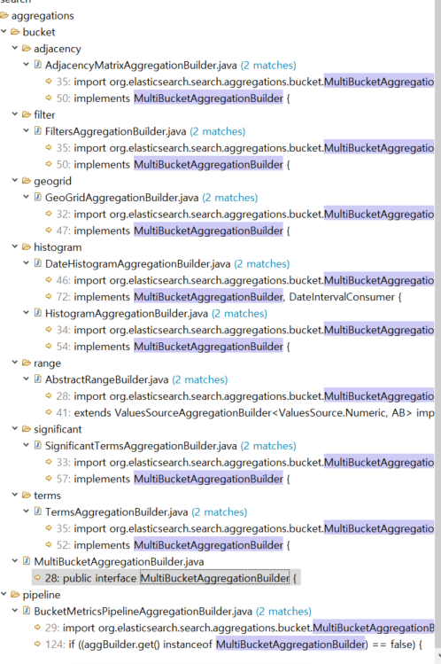

#Composite aggregation + Pipeline 결합하기?


BucketMetricsPipelineAggregationBuilder.java 에서 나오는 오류

```java
 public void doValidate(AggregatorFactory<?> parent, Collection<AggregationBuilder> aggBuilders,
            Collection<PipelineAggregationBuilder> pipelineAggregatorFactories) {
        if (bucketsPaths.length != 1) {
            throw new IllegalStateException(PipelineAggregator.Parser.BUCKETS_PATH.getPreferredName()
                    + " must contain a single entry for aggregation [" + name + "]");
        }
        // Need to find the first agg name in the buckets path to check its a
        // multi bucket agg: aggs are split with '>' and can optionally have a
        // metric name after them by using '.' so need to split on both to get
        // just the agg name
        final String firstAgg = bucketsPaths[0].split("[>\\.]")[0];
        Optional<AggregationBuilder> aggBuilder = aggBuilders.stream().filter((builder) -> builder.getName().equals(firstAgg))
                .findAny();
        if (aggBuilder.isPresent()) {
            if ((aggBuilder.get() instanceof MultiBucketAggregationBuilder) == false) {
                throw new IllegalArgumentException("The first aggregation in " + PipelineAggregator.Parser.BUCKETS_PATH.getPreferredName()
                        + " must be a multi-bucket aggregation for aggregation [" + name + "] found :"
                        + aggBuilder.get().getClass().getName() + " for buckets path: " + bucketsPaths[0]);
            }
        } else {
            throw new IllegalArgumentException(PipelineAggregator.Parser.BUCKETS_PATH.getPreferredName()
                    + " aggregation does not exist for aggregation [" + name + "]: " + bucketsPaths[0]);
        }
    }
```


 

1. doValidate를 쓰는 곳을찾자!! 
2. composite쿼리를 쓰지 않는 것은 잘되는걸 보니,      composite쿼리를 제외한 것을 알아보자 
3. 일반적인 term      aggregation 의 Collection\<AggregationBuilder\>      aggBuild에서 firstAgg라는 그룹의 이름을 가지고 사용하는것같다.

반환은 MultiBucketAggregationBuilder타입인것같다.

Collection\<AggregationBuilder\> 타입을 가지고 있는 appbuild, 

1. AggregationBuilder에서 getSubAggregations 함수를 활용해서 Collection\<AggregationBuilder>을 반환 

pipeline이라던지 slibing 쿼리를 검사 해서 반환하는 것 같다.

 

Elasticsearch 에서 MultiBucketAggregationBuilder를 구현체로 선언받은 클래스들은 아래와 같다.

 

Compositequery에서는 빠져있다. 

 



 


많은 bucket aggregation이 있지만 pipeline을 사용하는 어그리게이션은 (

adjacency Matrix, Filter Aggregation, GeoGrid Aggregation, histogram, range, significant, terms

) 과 같은 특정 aggregation들의 결과만 사용할 수 있는 것 같다.